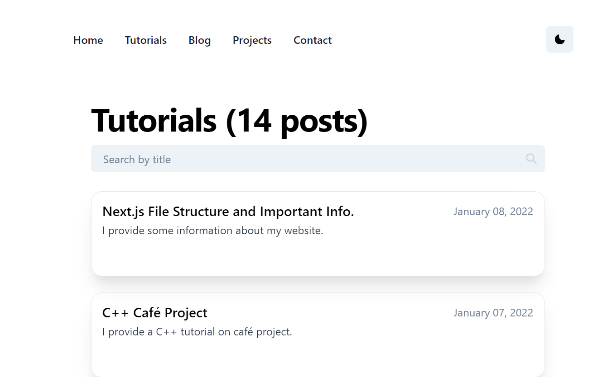

# Welcome to my Portfolio!

## 💡 Motivation 

Two years ago, I first got introduced to web development. It was all new and fascinating to me. I decided to build a blog, and followed a tutorial by [Benjamin Carlson](https://www.benjamincarlson.io/) to build my first live website. I had way too many packages and had many bad practices. So when I ran yarn dev and saw an error, I wasn't surprised. I knew it was finally time to refactor this codebase. After building it back from the ground up, I finally found the error: an outdated function from the package I was using to parse my markdown files to html. I learned a lot about next-mdx-remote, dynamic routing in Next.js, and using asynchronous fetching in this project. 

I had a lot of fun building this. I got to play with lots of different technologies while growing my knowledge of web development.

Feel free to [reach out](https://abneuro.vercel.app/) to me if you have any additional questions. There are lots of features that still need to be implemented!

## ✨ Pages 

1. **Home Page**: <br/>
 

2. **Tutorials Page**: <br/>
 

3. **Blog Page**: <br/>
 

4. **Projects Page**: <br/>
 

5. **Contact Page**: <br/>
 

## ⚡️ Technologies 

This site was built using Next.js and Chakra UI in the frontend. 

The posts are all markdown files stored locally.

**Why Next.js?**

Vercel make it really easy to deploy a website for free. In addition, I love the routing system and SEO benefits that Next.js offers. Next.js also makes it easy to work with API's!

The next time I do another project, I'm definitely looking forward to using TypeScript with Next.js!

**Why Markdown?**

Markdown makes it really easy to write blog posts. 

**Here is a simple diagram showing how markdown files can be parsed in Next.js:**

 

### API Routes
- /api/subscribe to post subscriber to mailchimp
- /api/github to fetch github repositories for projects page

### Important Libraries
- animate.css makes it easy to add page animations
- gray-matter is useful to parse markdown
- next-mdx-remote to pass the markdown parsed by gray-matter into a React Component that can be displayed on my posts page
- nprogress
- reading-time to show how long it takes to read my blog posts
- rehype-prism-plus and rehype-code-titles allow my code blocks to look aesthetic
- swr is valuable for fetching data

## Future Improvements
1. The ability to comment on a post.
2. Add pictures to the projects page.
3. Adding back the bubbles from abneuro version 1.
4. Adding the number of page views and users who have viewed the site.

## 👏 Contribute 

Contributions are welcome as always. Before submitting a new pull request, please make sure to open a new issue.

## Getting Started

First, run the development server:

```bash
npm run dev
# or
yarn dev
# or
pnpm dev
```

Open [http://localhost:3000](http://localhost:3000) with your browser to see the result.

## Deploy on Vercel

The easiest way to deploy your Next.js app is to use the [Vercel Platform](https://vercel.com/new?utm_medium=default-template&filter=next.js&utm_source=create-next-app&utm_campaign=create-next-app-readme) from the creators of Next.js.

Check out the [Next.js deployment documentation](https://nextjs.org/docs/deployment) for more details.
